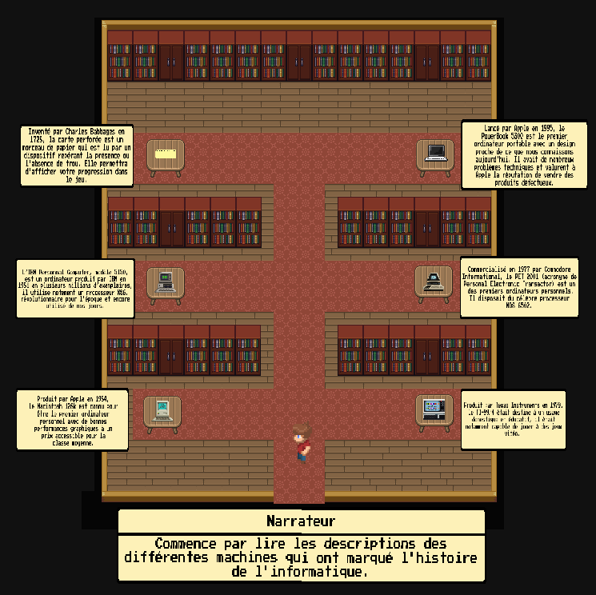
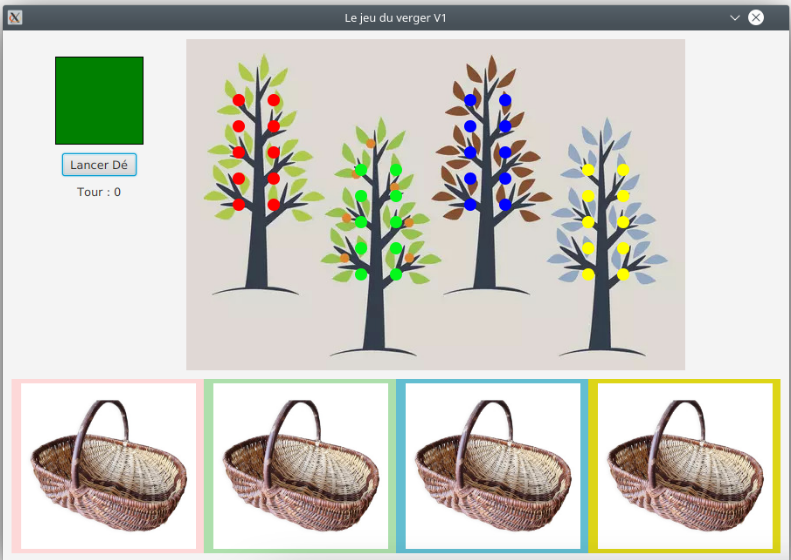
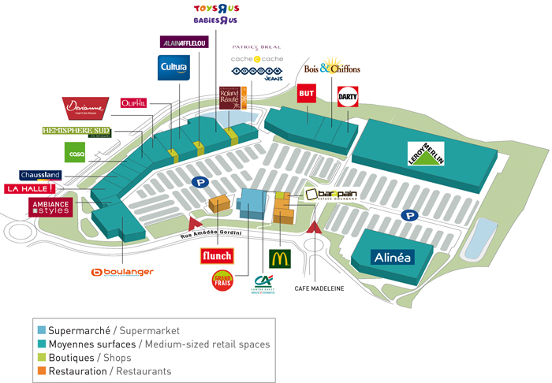
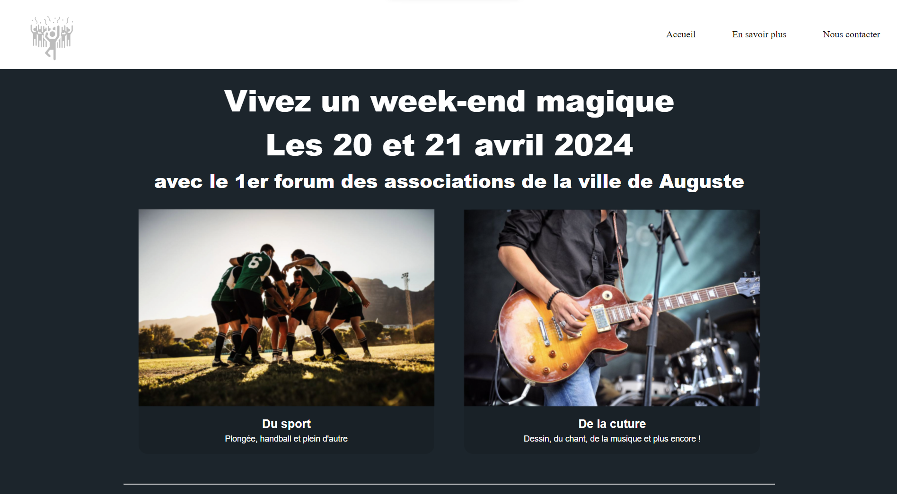
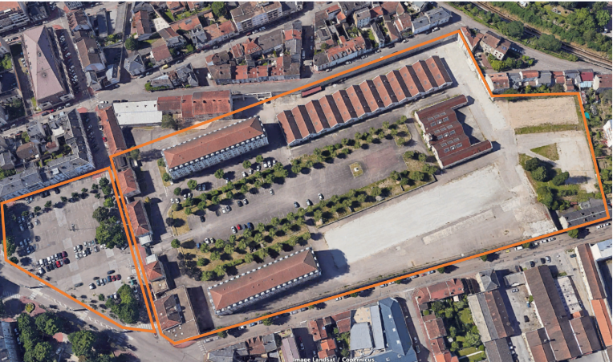
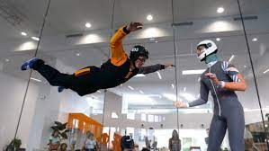

# PortFolio Lhuissier Rémi
Bienvenue sur mon portfolio ! Je m'appelle Rémi Lhuissier et je suis étudiant en 3ème année de [BUT Informatique](https://www.iut.unilim.fr/les-formations/but/informatique/) à l'IUT du Limousin.
Je suis quelqu’un de sérieux dans les études et le travail.
Le travail en équipe est pour moi un point essentiel dans la gestion de projets informatiques car il permet de travailler beaucoup plus efficacement en partagant différents points de vues et en apportant de précieuses compétences au projet.
Un collaborateur apporte un oeil neuf au projet et peut parfois résoudre beaucoup plus rapidement un éventuel bug informatique ou une erreur de logistique.

De plus, la passion, l’excellence et la collaboration sont pour moi des valeurs essentielles dans mon travail.

## Compétences personnelles

### Hard Skills

- Développement Web HTML, Javascript, php 
 
 

- La programation bash (Linux) 

- Le C++ 

- Le Java 

- Le Rust 

- Les bases de données 

- L'installation et le paramétrage de réseaux

- Le recueil des besoins d'un client 

- La gestion de projet 
- Niveau d'anglais correct

### Soft Skills
- Curieux, j’aime tester de nouveaux moyens de codage et suis ouvert à de nouvelles idées​

- Sérieux dans le travail​, mes compétences me permettent d'appréhender au mieux les difficultés auxquelles on doit s'attendre et de trouver efficacement des solutions pour les gérer. 

- Calme et patient, c'est un avantage pour résoudre des bugs informatiques ou pour concevoir des programmes.​

- Créatif, je suis capable de trouver des solutions aux problèmes, pouvant survenir lors de projets.

### Projets Réalisés

Mon parcours m’a permis de maîtriser les bases de la programmation bash sous Linux, Python, Java, C, SQL,
HTML/CSS/JS et PHP.

#### Créer un RAG - RAGAdmin pour La Poste

   

L'objectif est de concevoir un outil fonctionnant exclusivement en mode hors connexion, en s'appuyant uniquement sur des solutions open source. Les professionnels de La Poste doivent pouvoir interagir avec le chatbot via une interface simple où ils pourront poser leurs questions (via un prompt). Le chatbot, utilisant une architecture de type RAG (Retrieval-Augmented Generation), fournira des réponses pertinentes en s’appuyant sur une base de documentations locales.

Ce chatbot est destiné à assister les équipes de maintenance du système d'information (SI) dans leurs tâches de dépannage. Il doit être capable de lire et assimiler une documentation technique pour proposer des réponses adaptées aux requêtes des utilisateurs.
En outre, le chatbot doit être intégré dans une chaîne CI/CD qui permet :
- de gérer le déploiement de l’application,
- de relancer automatiquement les services en cas d’arrêt,
- d’envoyer des alertes en cas de dysfonctionnements,
et de garantir l'accessibilité des logs pour assurer un suivi fiable et efficace du système.

Pour cela, il a été mis a ma disposition un serveur R820 avec une carte Raid et 3 disques de 1 To.
Le système d'exploitation choisi est Ubuntu Server pour des raisons de performances (Proxmox étant trop lent pour virtualiser un LLM).

Nous avons dévloppé cette application en python et en HTML/JS via React.

#### Développer une application - TemporalIT

Le but de ce projet consistait à développer un escape game sur le theme de l'histoire de l'informatique.  
https://github.com/Anosy00/TemporalIT  
  

Le but est donc de réussir des énigmes sur le thème de l'informatique afin de pouvoir progresser dans le jeu.
Nous avons choisi de créer un jeu en pixel art inspirer du thème du jeu Pokemon Ruby, Sapphire et Emeraude (2002).

Pour ce projet, il était possible de choisir entres plusieurs langages de programmation comme le C#, Javascript ou des logiciels tel que Unity.
Nous avons choisis d’utiliser le C# car c’est un célèbre langage de programmation qui est optimisé pour le jeux vidéo ce qui correspondait à nos besoins.  

Il nous a fallut apprendre à manipuler le C# et le logiciel Godot engine (similaire à Unity) que nous avons choisit pour ses meilleurs performances.

La salle d'introduction sert de didactitiel du jeu.

#### Le jeu du verger - HABA
Lors d’un projet, j’ai créé plusieurs versions du jeu du verger de HABA en java. Pour cela, j’ai réalisé plusieurs étapes d’analyse et de rétro-conception, avant de me lancer dans le codage de cette application qui devait implémenter une interface graphique. Ce projet simulait au mieux les demandes d’un client en prenant en compte des rendus à dates fixes et des exigences précises comme les règles du jeu.\
https://git.unilim.fr/antoine19/leverger

#### Installer et parametrer correctement un Debian

Au cours d’un autre projet, j’ai installé une machine virtuelle de Debian sur Virtualbox que j’ai paramétrée correctement. Enfin, j’ai conçu un script bash qui crée automatiquement des comptes utilisateurs avec des logins et des mots de passe complexes.\
Ce projet m'a permis de renforcer mes compétences en programmation bash et en algorithmique.

#### Les réseaux d'entreprise

Au cours de ma formation, j’ai étudié les adresses IP et le fonctionnement des routeurs, ainsi que le filtrage des données sur un réseau afin d’en assurer la sécurité. Cela m’a permis de développer une solide compréhension des réseaux informatiques, de la maintenance matérielle, de la sécurité des données et de la résolution de problèmes informatiques. Dans ce cadre, j’ai simulé une infrastructure réseau sur kathara afin de paramétrer correctement les différents composants et créer une connexion ssh avec une machine virtuelle.

#### Collaborer au sein d'une équipe informatique

Nous avons fait des recherches sur développement web sur internet, mais également dans différents supports tels que des documents de presse ou différents ouvrages, afin d'élaborer des questions pertinantes à poser à notre professionnel. Nous avons ensuite pu rédiger nos connaissances et les indications du professionnel pour en faire une présentation de qualité.\
Ce Projet m'a permis d'enrichir mes connaissances des métiers professionnels. Cela à été un bon moyen d'apprentissage sur le travail en équipe et la coordination, afin d'aquérir des competences intrapersonnelles pour travailler en équipe car j'ai pu échenger, donner mon opignon, et travailler sur chaque étape du projet.

#### Concevoir et mettre en place une base de données

L'objectif de ce projet est de montrer que dans le cadre d'un nouveau besoin il est nécessaire d'étudier l'existant, de le maitriser et ensuite de proposer des extensions à la solution existante. Dans un premier temps j'ai réalisé une étude s'appuyant sur une base de données fournie. Le travail principal a consisté à récupérer des données brutes au format CSV puis utiliser le langage SQL pour les analyser et les stocker dans une base de données que j'ai préalablement conçue. Enfin j'ai créé des requêtes SQL afin de produire des analyses sous forme graphique.

#### Conduire un projet
##### Le Family Village

Le but de ce projet était de se mettre à la place des professionnels de l'époque qui ont construit le Familly Village de Limoges. Pour cela il était
nécessaire de prendre en compte les besoins et exigences de toutes les parties prenantes (affectée positivement ou négativement).
Il fallait donc imaginer leurs besoins et trouver un moyen d'y répondre afin de satisfaire le maximum de personnes.

J'ai su prendre en compte les besoins de chaque intervenant (Riverains, employé, professionnels, ...) en fonction de leurs exigences et contraintes.

Cela me sera utile afin de recueillir tes exigences et besoins d'un client lors de ma carrière professionnelle en informatique. Cette procédure me permet donc de gagner en autonomie et en capacité de réflexion sur un projet donné.

##### Le Forum des associations

Ce projet consistait à organiser un forum des association fictif :  
Nous étoins mandaté par Mme Lélu, Maire de Auguste, Pour organiser le premier forum des associations de la ville.  
Pour cela, il a été nécessaire d'établir une fiche de demande du projet, le SWOT, les objectifs SMART, Le cahier des charges, le plan de financement, les risques identifiés et les mesurer à mettre en place pour les gérer. Il a fallu également, à l'aide d'un diagramme de Gantt, établir l'organisation du projet en phases. J'ai créé l'organigramme de l'équipe projet et un mini site Web a été mis en place pour faire la promotion du forum.
https://git.unilim.fr/lhuissier4/sae205_siteinternet  

### Compétences travaillées

- Le travail en équipe
- La qualité de code
- Programmation Bash sous Linux, Python, Java, C, SQL, HTML
- Création d’algorithmes
- Création de bases de données complexes
- Création de pages HTML interactives
- Filtrage et sécurisation des réseaux
- Installation de réseau professionnel
- Installation d’un système d’exploitation
- Installation de logiciels
- Connaissance du fonctionnement du binaire
- Conduite de projets (identification des besoins clients) / organisation
- Rédaction de rapports
- Maîtrise des logiciels Word et Excel

## Contacts
Linkedin : https://www.linkedin.com/in/r%C3%A9mi-lhuissier-07a5502a0/

Email : remi.lhuissier@etu.unilim.fr

## A propos de moi...
2010-2022 : J'ai fait de la natation au club
SAM Mérignac et initiation au
sauvetage aquatique.\

Je suis passionné par l’espace
et l’informatique.\
Je pratique le vélo et la
marche.\
J’aime les romans
fantastiques/sciences fictions;\

Je suis également un adepte des
expériences à sensations : jet
ski, chute libre indoor,
gyropode, parachute,
ascensionnel, randonnée en
quad.\

